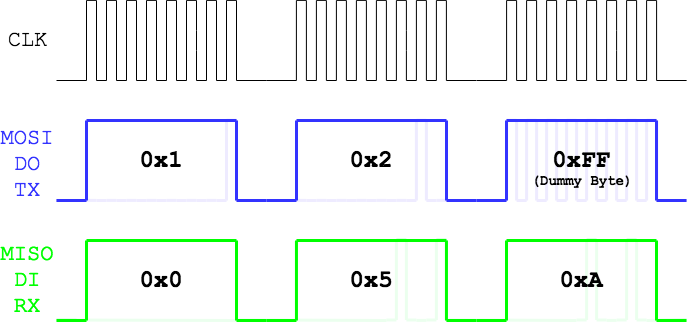

## SPI Library
**Files**: `SPI.h`, `SPI.c`
**Requires**: None
**Uses**: `SPI1`
**Author**: Nil Burción `nburcion@student.42.fr`


***
### Public
#### SPI Initialization

> **Warning**: The function `SPI_init` must be the first function called. If not the behaviour for all the other functions is undefined. The only exception of this rule is `SPI_started`

| Prototype     	| `void SPI_init(void)`        |
|---------------	|:-----------------------------|
| _Explanation_	| Initializes the SPI protocol |
| _Details_		| <li>Clear the SPI buffer</li> <li> Set up the Recive Done SPI interrupt (`IFS0bits.SPI1RXIx`)</li> <li>Configurate the SPI settings (Like Baud Rate, Master Mode, etc.)</li> <li>Set all the Slave Select pins to **`OUTPUT`**</li><li>Run `SPI_slave_select(SPI_NONE)` to unselect any slave</li> |


| Prototype     	| `bool SPI_started(void)`     |
|---------------	|:-----------------------------|
| _Explanation_	| Returns **`true`** or **`false`** depending on whether the SPI has been initialized (via `SPI_init`)|

| Prototype     	| `void SPI_slave_select(byte slave)`     |
|---------------	|:-----------------------------|
| _Explanation_	| Chooses a SPI Slave to talk with (Disabling all others). |
| _Arg:_ **slave**	 | The Slave to be selected (e.g. **`SPI_SD`**), or if all have to be disabled (**`SPI_NONE`**). _See `SPI.h` for the complete list of accepted arguments_ |


#### SPI Usage
To make things easier for the programmer the SPI Library works with two ([FIFO](https://en.wikipedia.org/wiki/FIFO_(computing_and_electronics))) queues. One for incoming data (RX) and the other for outgoing data (TX).

Things to be noted about the queue structure:

* The size of the queue is defined on `SPI.h` with the macro `SPI_BUFF_SIZE`
* Queued bytes won't be sent until `SPI_send` is executed
* Incoming bytes will be discarded depending on how they were sent (explained on `SPI_queue_byte`)
* The queue 'system' is what I call dynamic, what this means is that you can queue more bytes even when it's sending; And that you can read bytes even when it's sending. (Sending means while the TX buffer is still contains data)

#### SPI Usage: Write

| Prototype     	| `bool SPI_queue_byte(byte b, bool discard)`     |
|---------------	|:-----------------------------|
| _Explanation_	| Queue a byte on the SPI TX queue, and marking that the response to that byte should be discarded (or not). Returns **`true`** or **`false`** depending on whether the byte could be added to the queue or not. (When the function returns false it's because the TX buffer is full) |
| _Arg:_ **b**	| The byte to be queued |
| _Arg:_ **discard** | If the response byte to this yet-to-be-sent byte has to be discarded (**`true`**) or kept (**`false`**). In other words if the byte is marked to be discarded (**`true`**) the response byte to this queued byte will not be stored in the RX buffer, if not (**`false`**) it will be kept on the RX buffer.|
> **Warning**: Every time the function is called it should be checked that it returns **`true`** (like `malloc`).

&nbsp;

> **Note**: To better explain the discard/keep thing and the general SPI protocol here's an example

Let's assume we have an SPI Master (Our code) and a SPI Slave device that echoes back the numbers we send to it but multiplied by 5.


_(Diagram for all the code chunks)_

```c
#include "SPI.h"

/* In case we had something on the RX buffer, clear it first*/
byte b;
while (SPI_available())
	SPI_get_byte(&b);

SPI_init();

SPI_queue_byte(0x1, true);
SPI_queue_byte(0x2, false);
SPI_queue_byte(0xFF, false); // This is a dummy byte sent to keep the SPI Master Clock ticking so we can get the answer to our previous 0x2

SPI_send();
```
In this first example, at the end of the code the RX Buffer would contain: **`0x5`**, **`0xA`**.
So after executing this code, all this expressions would be true:

```c
SPI_get_byte(&b) == true
               b == 0x5
SPI_get_byte(&b) == true
               b == 0xA
SPI_get_byte(&b) == false
```

On the other hand at the end of the second code on the RX buffer only **`0x0`** and **`0x5`**

```c
#include "SPI.h"

/* In case we had something on the RX buffer, clear it first*/
byte b;
while (SPI_available())
	SPI_get_byte(&b);

SPI_init();

SPI_queue_byte(0x1, false);
SPI_queue_byte(0x2, false);
SPI_queue_byte(0xFF, true); // This is a dummy byte sent to keep the SPI Master Clock ticking so we can get the answer to our previous 0x2

SPI_send();
```  

| Prototype     	| `bool SPI_queue(byte b)`     |
|---------------	|:-----------------------------|
| _Explanation_	| It's an alias of the function `SPI_queue_byte` but it always discards the byte |
| _Arg:_ **b**	| The byte to be queued |

> **Note:** the actual function code is
> `return (SPI_queue_byte(b, true));`


| Prototype     	| `void SPI_send(void)`     |
|---------------	|:-----------------------------|
| _Explanation_	| Sends TX queue and waits until sent |

#### SPI Usage: Read

| Prototype     	| `bool SPI_get_byte(byte *b)`     |
|---------------	|:---------------------------------|
| _Explanation_	| Reads the next byte of the RX buffer and stores it in `*b`. Returns **`true`** on success or **`false`** if the buffer was empty. _(By reading you are discarding the byte. See below)_|
| _Arg:_ **\*b** | The pointer where to write the character that has been read. |

Let's go with an example. Supose you have the following RX buffer: **`[0xFE, 0x03, 0x55, 0xAA]`**
> **Note**: In this case let's suppose **`0xFE`** was the first one to enter the queue and **`0xAA`** the last one

Let's see what happens when we call this lines:

```c
byte b;
SPI_get_byte(&b); // Returns true and b is now 0xFE
SPI_get_byte(&b); // Returns true and b is now 0x03
SPI_get_byte(&b); // Returns true and b is now 0x55
SPI_get_byte(&b); // Returns true and b is now 0xAA;
SPI_get_byte(&b); // Returns false and b remains unchanged (So it's still 0xAA)
SPI_get_byte(&b); // Returns false and b remains unchanged (So it's still 0xAA)
...
SPI_get_byte(&b); // Returns false and b remains unchanged (So it's still 0xAA)
```

| Prototype     	| `bool SPI_read(size_t bytes, byte dummy)` |
|---------------	|:-----------------------------|
| _Explanation_	| This function is made to keep the SPI clock ticking when you expect a response back. To keep the clock ticking it sends a certain number of dummy bytes. It returns **`true`** or **`false`** depending if the operation was successful or not. (See note) |
| _Details_		| This function queues bytes and sends them with the functions: `SPI_queue_byte` and `SPI_send` respectively, so you should have that in account when using this function: It will send the already queued bytes on SPI. |
| _Arg:_ **bytes** | The number of dummy bytes to send. (i.e. the length in bytes of the expected response).
| _Arg:_ **dummy** | The 'dummy' byte to send. Usually **`0x00`** (the MOSI is kept low) or **`0xFF`** (the MOSI line is kept high)

> **Warning:** If `SPI_read` returns false it means the TX buffer has been appended with some (but not all) dummy bytes expected, in other words the SPI TX buffer contains an undefined (>0 and <`bytes`) amount of dummy bytes so it really depends but the function depending on `SPI_read` should return as if it had failed. Generaly it's a bad idea to retry because when `SPI_read` fails it means the TX buffer is full so retrying to put more bytes on an already full buffer will not work.

| Prototype     	| `bool SPI_get_response(size_t response_size, size_t wait_bytes,` `byte dummy, bool sleeping_bit, byte *response)` |
|---------------	|:-----------------------------|
| _Explanation_	| Because SPI_read is usually too primitive to be useful and the real-world SPI responses differ a lot to those theorical responses seen in diagrams that would make reading a simple SPI response cumbersome. So this function reads a fixed-size response to a buffer (`*response`) but correcting on the fly the biggest two potential issues when dealing with responses: <li> Delay in the response after the command</li> <li>Misaligment between the bytes</li> The two corrections are explained below in great detail.<br> Returns **`true`** on successful reading and **`false`** otherwise.<br>This function uses `SPI_read` (with all of it's consecuences, see `SPI_read`).
| _Arg:_ **response_size**	| The size of the response we are expecting |
| _Arg:_ **wait_bytes**		| The total bytes sent (to allow for the response to be delayed from the command). The recommended value for this argument is `GRACE_BYTES + response_size` |
| _Arg:_ **dummy**			| The dummy byte sent (see `SPI_read` for more details)
| _Arg:_ **sleeping_bit**	| The bit that is suposed to mark the `MISO` line is sleeping/idle. This should be in the slave specs. (Also see below)
| _Arg:_ **\*response**		| The pointer/array where the response bytes will be written

So let's clear up this bit alignment and extra bits thing:
Imagine our slave datasheet says that after sending the command **`0x11`** we should recive the response **`0x01AABB`**. Also in the data sheet it says that when either the slave or the master is not using the line it should keep the line high. So we send the 1 byte command and we are expecting an answer of 3 bytes. So once done this is the raw data we got:

<style> g { opacity: 0.4; } </style>

| # | MOSI        | MISO        | Notes |
|---|-------------|-------------|-------|
| 1 | **`0x11`**  |<g>`0xFF`</g>| We send the command **`0x11`**
| 2 |<g>`0xFF`</g>| **`0xFF`**  | ⬅ Expected: **`0x01`**
| 3 |<g>`0xFF`</g>| **`0xFF`**  | ⬅ Expected: **`0xAA`**
| 4 |<g>`0xFF`</g>| **`0xFE`**  | ⬅ Expected: **`0xBB`**
| 5 |<g>`0xFF`</g>|<g>`0x03`</g>|
| 6 |<g>`0xFF`</g>|<g>`0x55`</g>|
| 7 |<g>`0xFF`</g>|<g>`0x77`</g>|
| 8 |<g>`0xFF`</g>|<g>`0xFF`</g>|
| 9 |<g>`0xFF`</g>|<g>`0xFF`</g>|

So what happened? Well the slave told us to keep the line high when nothing was to be sent, so when nothing is to be sent we should expect all the bits to be `1`, ergo, the byte should be **'0xFF'**. So the bytes `2` and `3` on the `MISO` line should be interpreted as silence, why there is a silence? Probably because the slave is doing some operation and it needs time Usually no more than 5 bytes should remain in silence. Okay but it's not that the response is just padded. What happened? So, let's see the binary response to see what happened:

| # | MOSI        | MISO        | MISO Binary       | Expected Binary   |  Notes |
|---|-------------|-------------|-------------------|-------------------|--------|
| 1 | **`0x11`**  |<g>`0xFF`</g>|<g>`0b11111111`</g>|<g>`0b11111111`</g>| We send the command **`0x11`**
| 2 |<g>`0xFF`</g>|<g>`0xFF`</g>|<g>`0b11111111`</g>|<g>`0b11111111`</g>| <g>Thinking...</g>
| 3 |<g>`0xFF`</g>|<g>`0xFF`</g>|<g>`0b11111111`</g>|<g>`0b11111111`</g>| <g>Thinking...</g>
| 4 |<g>`0xFF`</g>| **`0xFE`**  | **`0b11111110`**  | **`0b00000001`**  | ⬅ Weird byte
| 5 |<g>`0xFF`</g>| **`0x03`**  | **`0b00000011`**  | **`0b10101010`**  | ⬅ Weird byte
| 6 |<g>`0xFF`</g>| **`0x55`**  | **`0b01010101`**  | **`0b10111011`**  | ⬅ Weird byte
| 7 |<g>`0xFF`</g>| **`0x77`**  | **`0b01110111`**  | **`0b11111111`**  | ⬅ Weird byte
| 8 |<g>`0xFF`</g>|<g>`0xFF`</g>|<g>`0b11111111`</g>|<g>`0b11111111`</g>| <g>No comunication</g>
| 9 |<g>`0xFF`</g>|<g>`0xFF`</g>|<g>`0b11111111`</g>|<g>`0b11111111`</g>| <g>No comunication</g>

Do you see what is happening:
To see it let's line up what we got vs what we expected:
**`0b11111110000000110101010101110111`** ⬅ What we got
**`0b000000011010101010111011        `** ⬅ Expected

Still you don't see it?

Let's pad it:
**`0b``1111111``000000011010101010111011``1       `** ⬅ What we got
**`0b``       ``000000011010101010111011``        `** ⬅ Expected
**`0b``7 bits ``   3 bytes (0x01AABB)   `` 1 bit  `**

Et voilà! Now it matches perfectly!
So what happened here? The bits were misaligned. So it means that the slave gave the response 1 bit before the expected time, or what is the same 7 bits after. So for some reason the slave misaligned the bits. The function `SPI_get_response` fixes this automatically (and also the silences). So let's show a complete code to see this function in action (using the previous example):

```c
byte response[3];											// Allocate space for the response

SPI_queue(0x11);											// Queue the command
SPI_send();													// Send the comand

SPI_get_response(3, GRACE_BYTES + 3, 0xFF, 1, response);	// Get the response;

response[0] == 0x01; 										// Should be true
response[1] == 0xAA; 										// Should be true
response[2] == 0xBB; 										// Should be true

```
***

### Private
| Prototype     	| `bool SPI_sending(void)`     |
|---------------	|:-----------------------------|
| _Explanation_	| Returns **`true`** if the SPI is currently sending bytes or **`false`** if idle. (i.e. returns **`true`** if the TX buffer is not empty) |


| Prototype     	| `bool SPI_available(void)`     |
|---------------	|:-----------------------------|
| _Explanation_	| Returns **`true`** if the SPI is has cached bytes to read or **`false`** if there are no bytes to read. (i.e. returns **`true`** if the RX buffer is not empty) |

| Prototype     	| `size_t SPI_misaligned_bits(byte b, bool sleeping_bit)` |
|---------------	|:-----------------------------|
| _Explanation_	| Returns the number of bits that have to be shifted to make: the first bit that is not the sleeping bit, first. (Example in `SPI_align_bits`).<br>If it returns 8 it means it's a sleeping byte (**`0b00000000`** or **`0x00`** when `sleeping_bit` is **`0`**, and **`0b11111111`** or **`0xFF`** when `sleeping_bit` is **`1`**) |
| _Arg:_ **b**	| The byte to analyze
| _Arg:_ **sleeping_bit** | If the line is ment to keep high when no comunnication is going on then sleeping_bit should be **`1`** if the line is ment to be low it should be **`0`** 

I hope this return table clears a little bit the things if they weren't clear enough:

| `b`             | `sleeping_bit` | Output |
|-----------------|----------------|--------|
|**`0b11111111`** | **`1`**        | **`8`**|
|**`0b11111110`** | **`1`**        | **`7`**|
|**`0b1111110-`** | **`1`**        | **`6`**|
|**`0b111110--`** | **`1`**        | **`5`**|
|**`0b11110---`** | **`1`**        | **`4`**|
|**`0b1110----`** | **`1`**        | **`3`**|
|**`0b110-----`** | **`1`**        | **`2`**|
|**`0b10------`** | **`1`**        | **`1`**|
|**`0b0-------`** | **`1`**        | **`0`**|

| `b`             | `sleeping_bit` | Output |
|-----------------|----------------|--------|
|**`0b00000000`** | **`0`**        | **`8`**|
|**`0b00000001`** | **`0`**        | **`7`**|
|**`0b0000001-`** | **`0`**        | **`6`**|
|**`0b000001--`** | **`0`**        | **`5`**|
|**`0b00001---`** | **`0`**        | **`4`**|
|**`0b0001----`** | **`0`**        | **`3`**|
|**`0b001-----`** | **`0`**        | **`2`**|
|**`0b01------`** | **`0`**        | **`1`**|
|**`0b1-------`** | **`0`**        | **`0`**|


| Prototype     	| `byte SPI_align_bits(size_t displacement, byte b1, byte b2)` |
|---------------	|:-----------------------------|
| _Explanation_	| Returns an aligned byte |
| _Arg:_ **displacement**	| The displacement (calculated in `SPI_misaligned_bits`)
| _Arg:_ **b1** | The byte
| _Arg:_ **b2** | The following byte 

This couple of functions are the ones needed to fix the misalignment problem explained in `SPI_get_response`. So let's go back to the example used in `SPI_get_response`:

We had this first weird byte: **`0b11111110`** and the next byte was **`0b00000011`** so if we calculate the misalignment:

```c
SPI_misaligned_bits(0b11111110, 1);
```
The output is 7, 7 bits misaligned (the same we could observe before manually).
Then if we execute:

```c
SPI_align_bits(7, 0b11111110, 0b00000011);
```
The output is **`0b00000001`**, which is **`0x01`**
As the alignment is constant through the same chain of bytes, we can do the following:

```c
SPI_align_bits(7, 0b11111110, 0b00000011); // 0b00000001 or 0x01
SPI_align_bits(7, 0b00000011, 0b01010101); // 0b10101010 or 0xAA
SPI_align_bits(7, 0b01010101, 0b01110111); // 0b10111011 or 0xBB
```


#!!!!!!!!!!!!! Slave Select all up